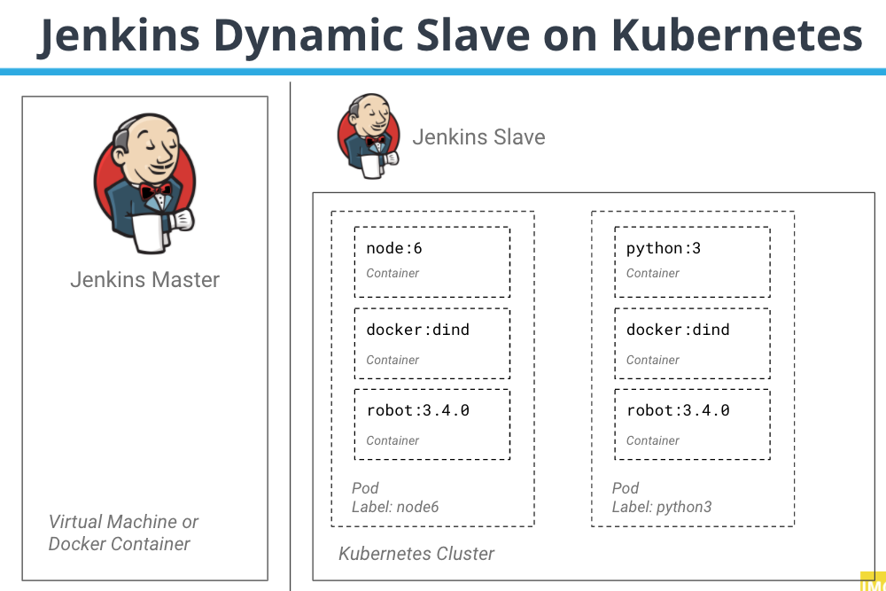

# Jenkins Dynamic Slave on Kubernetes

## Architecture



## Setup

### Helm3

```bash
kubectl delete ns jenkins
kubectl create ns jenkins
helm search hub jenkins
helm repo add jenkins https://charts.jenkins.io
helm repo update
kubectl config get-contexts
## get kubernetes context
kubectl config get-contexts
## change namespace to jenkins
kubectl config set-context $(kubectl config current-context) --namespace=jenkins

helm list
 # Change serviceType to LoadBalancer
serviceType: LoadBalancer
##helm install [RELEASE_NAME] jenkins/jenkins [flags]
helm install jenkins -f jenkins/values.yaml stable/jenkins -n jenkins
watch kubectl get all -n jenkins

printf $(kubectl get secret --namespace jenkins jenkins -o jsonpath="{.data.jenkins-admin-password}" | base64 --decode);echo
kubectl logs jenkins-54c9cb5465-xvdg4 -c jenkins -f


```
